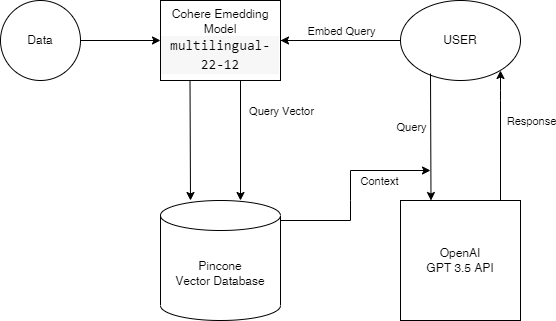

# Retrieval Question Answering Chatbot    

## Description

The chatbot follows the following flow diagram which uses Cohere embedding model multilingual-22-12 and OpenAI's GPT3.5 API for generation and pincone as vector database for context. For handling context and vectors langchain is used.

## Sources

Dataset with embeddings: https://huggingface.co/datasets/Cohere/wikipedia-22-12-simple-embeddings

